# 1. Diagrama de Classes

## 1.1 Visão Geral

Este diagrama modela as classes envolvidas nas **3 fatias verticais selecionadas**, com foco em:

- Estrutura de domínio (entidades, value objects)
- Responsabilidades de cada classe (métodos não-triviais)
- Relacionamentos com cardinalidades explícitas
- Aplicação de padrões de projeto (Strategy, State, Factory)

**Classes modeladas**: 23 classes cobrindo as três fatias, organizadas em 4 pacotes conceituais.

---

## 1.2 Diagrama UML (Mermaid)

```mermaid
classDiagram
    %% ============================================
    %% PACOTE: Pedidos e Catálogo
    %% ============================================
    
    class Cliente {
        -UUID id
        -String nome
        -String cpf
        -String email
        -String telefone
        -Endereco enderecoAtual
        -List~FormaPagamento~ formasPagamento
        -PontosFidelidade pontos
        +adicionarAoCarrinho(Item item)
        +aplicarCupom(Cupom cupom)
        +finalizarPedido() Pedido
    }
    
    class Carrinho {
        -UUID id
        -Cliente cliente
        -EmpresaParceira empresa
        -List~ItemCarrinho~ itens
        -Cupom cupomAplicado
        -BigDecimal subtotal
        -BigDecimal taxaEntrega
        +adicionarItem(Produto produto, int qtd)
        +removerItem(UUID itemId)
        +calcularTotal() BigDecimal
        +validarDisponibilidade() boolean
    }
    
    class ItemCarrinho {
        -UUID id
        -Produto produto
        -int quantidade
        -BigDecimal precoUnitario
        -String observacoes
        +calcularSubtotal() BigDecimal
    }
    
    class Produto {
        -UUID id
        -String nome
        -String descricao
        -BigDecimal preco
        -CategoriaProduto categoria
        -boolean disponivel
        -int quantidadeEstoque
        +atualizarEstoque(int delta)
        +validarDisponibilidade(int qtd) boolean
    }
    
    class Cupom {
        -String codigo
        -TipoDesconto tipo
        -BigDecimal valor
        -LocalDateTime validadeInicio
        -LocalDateTime validadeFim
        -int usoMaximo
        -int usoAtual
        +validar(Carrinho carrinho) boolean
        +aplicarDesconto(BigDecimal subtotal) BigDecimal
        +incrementarUso()
    }
    
    class EmpresaParceira {
        -UUID id
        -String razaoSocial
        -String cnpj
        -Endereco endereco
        -List~Produto~ catalogo
        -HorarioFuncionamento horarios
        -boolean aceitandoPedidos
        +adicionarProduto(Produto produto)
        +alterarDisponibilidade(boolean status)
    }
    
    %% ============================================
    %% PACOTE: Pedido e Pagamento
    %% ============================================
    
    class Pedido {
        -UUID id
        -String numeroPedido
        -Cliente cliente
        -EmpresaParceira empresa
        -List~ItemPedido~ itens
        -Endereco enderecoEntrega
        -BigDecimal valorTotal
        -StatusPedido status
        -LocalDateTime dataCriacao
        -Pagamento pagamento
        -Entrega entrega
        +confirmarPagamento(Pagamento pag)
        +atribuirEntrega(Entrega entrega)
        +cancelar(String motivo)
        +atualizarStatus(StatusPedido novoStatus)
    }
    
    class ItemPedido {
        -UUID id
        -Produto produto
        -int quantidade
        -BigDecimal precoUnitario
        -BigDecimal subtotal
    }
    
    class Pagamento {
        -UUID id
        -Pedido pedido
        -FormaPagamento forma
        -BigDecimal valor
        -StatusPagamento status
        -String transacaoGatewayId
        -LocalDateTime dataProcessamento
        +processar() ResultadoPagamento
        +estornar() boolean
        +confirmar()
    }
    
    class FormaPagamento {
        <<abstract>>
        -UUID id
        -TipoPagamento tipo
        +validar() boolean
        +obterDadosGateway() Map
    }
    
    class CartaoCredito {
        -String numeroMascara
        -String nomeTitular
        -int mesValidade
        -int anoValidade
        -BandeiraCartao bandeira
        +validar() boolean
    }
    
    class PIX {
        -String chave
        -TipoChavePIX tipoChave
        +validar() boolean
    }
    
    class GatewayPagamento {
        <<interface>>
        +processarPagamento(Pagamento pag) ResultadoPagamento
        +estornarPagamento(String transacaoId) boolean
        +consultarStatus(String transacaoId) StatusPagamento
    }
    
    %% ============================================
    %% PACOTE: Logística e Entrega
    %% ============================================
    
    class Entrega {
        -UUID id
        -Pedido pedido
        -Entregador entregador
        -Endereco origem
        -Endereco destino
        -BigDecimal distanciaKm
        -BigDecimal valorFrete
        -EstadoEntrega estadoAtual
        -LocalDateTime dataAtribuicao
        -LocalDateTime dataColeta
        -LocalDateTime dataEntrega
        -List~PontoRastreamento~ rastreamento
        +atribuirEntregador(Entregador ent)
        +confirmarColeta()
        +atualizarLocalizacao(Localizacao loc)
        +confirmarEntrega(String codigoConfirmacao)
        +transicionarEstado(EventoEntrega evento)
    }
    
    class EstadoEntrega {
        <<interface>>
        +processar(EventoEntrega evento, Entrega entrega) EstadoEntrega
        +notificarPartes(Entrega entrega)
    }
    
    class AguardandoAceite {
        -LocalDateTime timestampCriacao
        +processar(EventoEntrega evento, Entrega entrega) EstadoEntrega
        +verificarTimeout() boolean
    }
    
    class EmTransito {
        -Localizacao localizacaoAtual
        -BigDecimal velocidadeKmh
        +processar(EventoEntrega evento, Entrega entrega) EstadoEntrega
        +calcularTempoRestante() Duration
    }
    
    class Entregue {
        -String codigoConfirmacao
        -LocalDateTime dataConfirmacao
        +processar(EventoEntrega evento, Entrega entrega) EstadoEntrega
    }
    
    class Entregador {
        -UUID id
        -String nome
        -String cpf
        -String telefone
        -String placa
        -TipoVeiculo veiculo
        -boolean disponivel
        -Localizacao localizacaoAtual
        -PerfilGamificacao perfil
        -BigDecimal avaliacaoMedia
        -int totalEntregas
        +aceitarEntrega(Entrega entrega) boolean
        +atualizarLocalizacao(Localizacao loc)
        +finalizarEntrega(Entrega entrega)
        +calcularBonificacao(Entrega entrega) BigDecimal
    }
    
    class AlgoritmoMatching {
        <<interface>>
        +encontrarMelhorEntregador(Pedido pedido, List~Entregador~ disponiveis) Entregador
    }
    
    class MatchingPorProximidade {
        +encontrarMelhorEntregador(Pedido pedido, List~Entregador~ disponiveis) Entregador
        -calcularDistancia(Localizacao a, Localizacao b) BigDecimal
        -calcularScore(Entregador ent, Pedido ped) BigDecimal
    }
    
    class PontoRastreamento {
        -UUID id
        -Localizacao localizacao
        -LocalDateTime timestamp
        -String descricao
    }
    
    class Avaliacao {
        -UUID id
        -Entrega entrega
        -int nota
        -String comentario
        -TipoAvaliacao tipo
        -LocalDateTime data
        +validarNota() boolean
    }
    
    %% ============================================
    %% PACOTE: Gamificação
    %% ============================================
    
    class PerfilGamificacao {
        -UUID id
        -Entregador entregador
        -int pontosAcumulados
        -NivelEntregador nivel
        -List~Badge~ badges
        -int streakDias
        -RankingSemanal ranking
        +adicionarPontos(int pontos)
        +desbloquearBadge(Badge badge)
        +atualizarStreak()
        +calcularBonus() BigDecimal
    }
    
    class Badge {
        -UUID id
        -String nome
        -String descricao
        -String iconePath
        -CriterioBadge criterio
        -LocalDateTime dataDesbloqueio
        +verificarDesbloqueio(Entregador ent) boolean
    }
    
    class CalculadoraBonificacao {
        <<interface>>
        +calcular(Entrega entrega, PerfilGamificacao perfil) BigDecimal
    }
    
    class BonificacaoComposta {
        -BigDecimal percentualBase
        -Map~String,BigDecimal~ multiplicadores
        +calcular(Entrega entrega, PerfilGamificacao perfil) BigDecimal
        -aplicarMultiplicadorHorario(LocalDateTime hora) BigDecimal
        -aplicarMultiplicadorRegiao(Endereco end) BigDecimal
        -aplicarMultiplicadorStreak(int streak) BigDecimal
    }
    
    class RankingSemanal {
        -int semana
        -int ano
        -List~PosicaoRanking~ posicoes
        +atualizarRanking(List~Entregador~ entregadores)
        +obterPosicao(Entregador ent) int
    }
    
    %% ============================================
    %% Value Objects e Enums
    %% ============================================
    
    class Endereco {
        <<value object>>
        -String logradouro
        -String numero
        -String complemento
        -String bairro
        -String cidade
        -String estado
        -String cep
        -Localizacao coordenadas
    }
    
    class Localizacao {
        <<value object>>
        -BigDecimal latitude
        -BigDecimal longitude
        +calcularDistancia(Localizacao outra) BigDecimal
    }
    
    class StatusPedido {
        <<enumeration>>
        AGUARDANDO_PAGAMENTO
        PAGO
        EM_PREPARACAO
        PRONTO_COLETA
        EM_ENTREGA
        ENTREGUE
        CANCELADO
    }
    
    class StatusPagamento {
        <<enumeration>>
        PENDENTE
        PROCESSANDO
        APROVADO
        RECUSADO
        ESTORNADO
    }
    
    class TipoDesconto {
        <<enumeration>>
        PERCENTUAL
        VALOR_FIXO
        FRETE_GRATIS
    }
    
    class NivelEntregador {
        <<enumeration>>
        BRONZE
        PRATA
        OURO
        PLATINA
        DIAMANTE
    }
    
    %% ============================================
    %% RELACIONAMENTOS
    %% ============================================
    
    %% Cliente e Carrinho
    Cliente "1" --> "0..1" Carrinho : possui
    Carrinho "1" *-- "1..*" ItemCarrinho : contém
    ItemCarrinho "1" --> "1" Produto : referencia
    Carrinho "1" --> "0..1" Cupom : aplica
    Carrinho "1" --> "1" EmpresaParceira : compra de
    
    %% Pedido
    Cliente "1" --> "0..*" Pedido : realiza
    Pedido "1" *-- "1..*" ItemPedido : contém
    ItemPedido "1" --> "1" Produto : referencia
    Pedido "1" --> "1" EmpresaParceira : realizado em
    Pedido "1" --> "1" Endereco : entrega em
    
    %% Pagamento
    Pedido "1" --> "1" Pagamento : possui
    Pagamento "1" --> "1" FormaPagamento : usa
    FormaPagamento <|-- CartaoCredito
    FormaPagamento <|-- PIX
    Pagamento ..> GatewayPagamento : usa
    
    %% Entrega
    Pedido "1" --> "0..1" Entrega : tem
    Entrega "1" --> "1" Entregador : atribuída a
    Entrega "1" --> "1" EstadoEntrega : estado atual
    EstadoEntrega <|.. AguardandoAceite
    EstadoEntrega <|.. EmTransito
    EstadoEntrega <|.. Entregue
    Entrega "1" *-- "0..*" PontoRastreamento : rastreia com
    
    %% Matching
    AlgoritmoMatching <|.. MatchingPorProximidade
    MatchingPorProximidade ..> Entregador : consulta
    
    %% Avaliação
    Entrega "1" --> "0..2" Avaliacao : recebe
    
    %% Gamificação
    Entregador "1" --> "1" PerfilGamificacao : possui
    PerfilGamificacao "1" *-- "0..*" Badge : desbloqueou
    PerfilGamificacao "1" --> "0..1" RankingSemanal : participa de
    
    %% Bonificação
    CalculadoraBonificacao <|.. BonificacaoComposta
    Entregador ..> CalculadoraBonificacao : usa para calcular
    
    %% Value Objects
    Cliente "1" --> "1..*" Endereco : possui
    Entregador "1" --> "1" Localizacao : está em
    PontoRastreamento "1" --> "1" Localizacao : registra
```

---

## 1.3 Justificativas de Design

### 1.3.1 Herança: `FormaPagamento`

A classe abstrata `FormaPagamento` permite extensibilidade (adicionar Boleto, Wallet no futuro) sem modificar código existente. `CartaoCredito` e `PIX` herdam comportamento comum (`validar()`) mas implementam `obterDadosGateway()` de forma específica.

### 1.3.2 Interface: `GatewayPagamento`

Abstrair o gateway externo (Stripe, Mercado Pago) como interface permite trocar provedor sem impactar `Pagamento`. Aplicação do **Dependency Inversion Principle**.

### 1.3.3 Padrão State: `EstadoEntrega`

Implementação do padrão **State** para ciclo de vida da entrega. Cada estado concreto (`AguardandoAceite`, `EmTransito`, `Entregue`) implementa lógica de transição específica. Evita condicionais gigantes do tipo `if (estado == "X")`.

**Benefício**: adicionar novo estado intermediário (ex.: `AguardandoCliente`) não quebra estados existentes.

### 1.3.4 Padrão Strategy: `AlgoritmoMatching` e `CalculadoraBonificacao`

Permitem trocar algoritmo de matching ou fórmula de bonificação em runtime. Por exemplo:
- Em horário de pico: usar `MatchingPorUrgencia` (prioriza entregadores mais rápidos)
- Em horário normal: usar `MatchingPorProximidade`

### 1.3.5 Composição vs. Agregação

- **Composição** (`*--`): `Pedido` compõe `ItemPedido` — itens não existem sem pedido.
- **Agregação** (`o--`): `Carrinho` agrega `Produto` — produtos existem independentemente.

### 1.3.6 Atributos Calculados

Métodos como `calcularTotal()`, `calcularBonificacao()` **não correspondem a atributos persistidos** — são derivados. Isso será refletido no MER (Seção 2).

### 1.3.7 Responsabilidades Não-Triviais

Evitamos listar getters/setters. Métodos modelados:
- `Pedido.cancelar()` — regra: só pode cancelar se status != ENTREGUE
- `Entregador.calcularBonificacao()` — aplica lógica de multiplicadores
- `Carrinho.validarDisponibilidade()` — consulta estoque em tempo real

---

## 1.4 Classes por Fatia

| Fatia | Classes Principais |
|-------|-------------------|
| **Fatia 1** | `Cliente`, `Carrinho`, `Pedido`, `Pagamento`, `GatewayPagamento`, `AlgoritmoMatching`, `Entregador` |
| **Fatia 2** | `Entrega`, `EstadoEntrega` (e subclasses), `Entregador`, `PontoRastreamento`, `Avaliacao` |
| **Fatia 3** | `PerfilGamificacao`, `Badge`, `CalculadoraBonificacao`, `RankingSemanal` |

Classes compartilhadas entre fatias: `Entregador`, `Pedido`, `Endereco`, `Localizacao`.

---

## 1.5 Decisões de Modelagem Discutidas

### Por que `Entrega` e `Pedido` são classes separadas?

Inicialmente consideramos `Pedido` conter tudo. Separamos porque:
- Um pedido pode ser **cancelado antes da entrega ser criada**
- Uma entrega pode ser **reatribuída** a outro entregador (pedido continua o mesmo)
- Estados são ortogonais: pedido "PAGO" não implica entrega "ACEITA"

### Por que não modelamos `Notificacao` como classe?

Notificações são **eventos**, não entidades. Modelar seria criar classe God com 50 tipos de notificação. Melhor tratar como efeito colateral das transições de estado (expressas em diagrama de estados).

### Alternativa descartada: tabela única de `Produto`

Consideramos ter `ProdutoAlimenticio`, `ProdutoFarmacia`, etc. como subclasses. Descartamos porque:
- Produtos de categorias diferentes não têm comportamentos distintos (apenas atributos diferentes)
- Atributos variáveis serão modelados como JSON flexível (`atributosExtras`)

Mantivemos `Produto` único com `CategoriaProduto` enum.

---

**Próximo:** [`docs/02-mer.md`](02-mer.md)
