# 3. Modelagem Comportamental — Fatia 1

## Cliente realiza pedido com pagamento e alocação automática de entregador

---

## 3.1 Escolha do Tipo de Diagrama

**Diagrama selecionado**: **Diagrama de Sequência**

**Justificativa**: Esta fatia envolve **coordenação entre 6 componentes** (Cliente → Frontend → Backend → Gateway de Pagamento → Serviço de Matching → Entregador), com múltiplos pontos de falha que exigem compensação. Diagrama de sequência é ideal para mostrar:

- **Ordem temporal** das interações
- **Mensagens síncronas** (aguardar resposta) vs. **assíncronas** (fire-and-forget)
- **Fragmentos combinados** (`alt`, `opt`) para caminhos de erro
- **Retornos** de chamadas que afetam decisões subsequentes

Diagrama de estados seria inadequado aqui — não há uma entidade única com ciclo de vida, mas sim uma **orquestração** entre serviços.

---

## 3.2 Diagrama de Sequência UML (Mermaid)

```mermaid
sequenceDiagram
    actor Cliente
    participant Frontend
    participant Backend
    participant GatewayPagamento
    participant ServicoMatching
    participant Entregador
    participant NotificacaoService

    Note over Cliente,NotificacaoService: Fatia 1: Fluxo completo de pedido com pagamento e matching

    %% ============================================
    %% FASE 1: Montagem do carrinho
    %% ============================================
    
    Cliente->>Frontend: Adiciona itens ao carrinho
    Frontend->>Backend: POST /carrinho/itens {produto_id, qtd}
    Backend->>Backend: Validar disponibilidade em estoque
    
    alt Item disponível
        Backend-->>Frontend: 200 OK {carrinho atualizado}
        Frontend-->>Cliente: Exibe carrinho atualizado
    else Item indisponível
        Backend-->>Frontend: 409 Conflict {erro: sem estoque}
        Frontend-->>Cliente: Mensagem: "Produto esgotado"
    end

    %% ============================================
    %% FASE 2: Aplicação de cupom (opcional)
    %% ============================================
    
    opt Cliente tem cupom
        Cliente->>Frontend: Aplica cupom PRIMEIRACOMPRA
        Frontend->>Backend: POST /carrinho/cupom {codigo}
        Backend->>Backend: Validar cupom (vigência, uso máximo)
        
        alt Cupom válido
            Backend->>Backend: Calcular desconto
            Backend-->>Frontend: 200 OK {desconto aplicado}
            Frontend-->>Cliente: Exibe valor com desconto
        else Cupom inválido
            Backend-->>Frontend: 400 Bad Request {erro: cupom expirado}
            Frontend-->>Cliente: Mensagem de erro
        end
    end

    %% ============================================
    %% FASE 3: Finalizar pedido (criar pedido)
    %% ============================================
    
    Cliente->>Frontend: Clica "Finalizar Pedido"
    Frontend->>Backend: POST /pedidos {carrinho_id, endereco_id, forma_pagamento}
    
    Backend->>Backend: Validar disponibilidade final (double-check)
    
    alt Algum item ficou indisponível
        Backend-->>Frontend: 409 Conflict {itens indisponíveis: [IDs]}
        Frontend-->>Cliente: Erro: "Alguns itens não estão mais disponíveis"
        Note over Cliente,Backend: Fluxo interrompido — cliente ajusta carrinho
    else Todos disponíveis
        Backend->>Backend: Criar Pedido (status: AGUARDANDO_PAGAMENTO)
        Backend->>Backend: Reservar itens no estoque (soft lock)
        Backend-->>Frontend: 201 Created {pedido_id, valor_total}
    end

    %% ============================================
    %% FASE 4: Processamento de pagamento
    %% ============================================
    
    Frontend->>Backend: POST /pedidos/{id}/pagar
    Backend->>GatewayPagamento: Processar pagamento {valor, forma_pagamento}
    
    Note over GatewayPagamento: Gateway externo (Stripe/Mercado Pago)<br/>Validação de cartão, saldo, etc.
    
    alt Pagamento aprovado
        GatewayPagamento-->>Backend: 200 OK {transacao_id, status: APROVADO}
        Backend->>Backend: Atualizar Pedido (status: PAGO)
        Backend->>Backend: Confirmar reserva de estoque (hard lock)
        Backend->>Backend: Criar registro de Pagamento
        
        %% ============================================
        %% FASE 5: Algoritmo de matching de entregador
        %% ============================================
        
        Backend->>ServicoMatching: Encontrar entregador {pedido_id, endereco_origem, endereco_destino}
        
        Note over ServicoMatching: Algoritmo de matching:<br/>1. Filtrar entregadores disponíveis na região<br/>2. Calcular distância de cada um até origem<br/>3. Ordenar por score (distância + avaliação + tempo resposta)<br/>4. Enviar notificação para Top 3
        
        ServicoMatching->>ServicoMatching: Consultar entregadores disponíveis (raio 5km)
        
        alt Nenhum entregador disponível
            ServicoMatching-->>Backend: 404 Not Found {erro: sem entregadores}
            Backend->>Backend: Atualizar Pedido (status: AGUARDANDO_ENTREGADOR)
            Backend->>NotificacaoService: Alertar time operacional
            Backend-->>Frontend: 202 Accepted {pedido criado, buscando entregador}
            Frontend-->>Cliente: "Pedido confirmado! Procurando entregador..."
            
        else Entregadores encontrados
            ServicoMatching->>ServicoMatching: Calcular score e ordenar
            ServicoMatching->>ServicoMatching: Selecionar Top 3
            
            loop Para cada entregador (max 3)
                ServicoMatching->>Entregador: PUSH Notification {pedido_id, detalhes}
            end
            
            ServicoMatching->>Backend: Aguardar aceite (timeout 2min)
            
            alt Entregador aceita em <2min
                Entregador->>Backend: POST /entregas/{id}/aceitar
                Backend->>Backend: Criar Entrega (estado: ACEITA)
                Backend->>Backend: Marcar entregador como indisponível
                Backend->>Backend: Atualizar Pedido (status: EM_PREPARACAO)
                
                Backend-->>Frontend: 200 OK {entrega atribuída, entregador: {...}}
                Frontend-->>Cliente: "Pagamento confirmado! Seu pedido está sendo preparado."
                
                Backend->>NotificacaoService: Notificar empresa (preparar pedido)
                NotificacaoService->>EmpresaParceira: PUSH "Novo pedido: #{numero}"
                
                Backend->>NotificacaoService: Notificar entregador (detalhes da entrega)
                NotificacaoService->>Entregador: PUSH "Entrega aceita. Colete em {empresa}"
                
            else Timeout — nenhum aceita em 2min
                ServicoMatching-->>Backend: 408 Timeout {nenhum aceitou}
                Backend->>Backend: Reenviar para próximos 3 entregadores
                Note over Backend,ServicoMatching: Retry automático (max 3 tentativas)
                
                alt Terceira tentativa falhou
                    Backend->>Backend: Atualizar Pedido (status: AGUARDANDO_ENTREGADOR)
                    Backend->>NotificacaoService: Escalate para operação manual
                    Backend-->>Frontend: 202 Accepted {pedido confirmado, buscando entregador}
                    Frontend-->>Cliente: "Pagamento OK. Procurando entregador (pode demorar)."
                end
            end
        end
        
    else Pagamento recusado
        GatewayPagamento-->>Backend: 402 Payment Required {erro: CARTAO_RECUSADO}
        
        %% ============================================
        %% COMPENSAÇÃO: reverter reserva de estoque
        %% ============================================
        
        Backend->>Backend: Liberar reserva de estoque (soft unlock)
        Backend->>Backend: Atualizar Pedido (status: PAGAMENTO_RECUSADO)
        Backend->>Backend: Criar registro de Pagamento (status: RECUSADO)
        Backend-->>Frontend: 402 Payment Required {erro: pagamento recusado}
        Frontend-->>Cliente: Erro: "Pagamento recusado. Verifique seu cartão."
        
        Note over Cliente,Backend: Carrinho permanece intacto.<br/>Cliente pode tentar outra forma de pagamento.
    
    else Gateway indisponível
        GatewayPagamento-->>Backend: 503 Service Unavailable
        Backend->>Backend: Liberar reserva de estoque
        Backend->>Backend: Atualizar Pedido (status: ERRO_PAGAMENTO)
        Backend-->>Frontend: 503 Service Unavailable
        Frontend-->>Cliente: Erro: "Sistema de pagamento temporariamente indisponível. Tente novamente."
    end
```

---

## 3.3 Análise de Elementos do Diagrama

### 3.3.1 Participantes (Lifelines)

| Participante | Tipo | Responsabilidade |
|--------------|------|------------------|
| **Cliente** | Actor | Inicia o fluxo; toma decisões (aplicar cupom, finalizar) |
| **Frontend** | Boundary | Interface; valida inputs antes de enviar ao backend |
| **Backend** | Control + Entity | Orquestra fluxo; aplica regras de negócio; persiste dados |
| **GatewayPagamento** | External System | Autoriza transações financeiras (Stripe, Mercado Pago) |
| **ServicoMatching** | Control | Algoritmo de seleção de entregador |
| **Entregador** | Actor | Aceita/rejeita entrega notificada |
| **NotificacaoService** | Control | Envia push notifications (Firebase/OneSignal) |

### 3.3.2 Fragmentos Combinados Utilizados

#### `alt` (Alternative) — Linha 16, 31, 53, 76, 90, 108

Representa **decisões binárias** com caminhos mutuamente exclusivos:
- Item disponível vs. indisponível
- Cupom válido vs. inválido
- Pagamento aprovado vs. recusado vs. gateway indisponível
- Entregador encontrado vs. não encontrado

**Semântica**: apenas um dos caminhos é executado.

#### `opt` (Optional) — Linha 28

Representa **fluxo condicional** que pode ou não ocorrer:
- Aplicação de cupom é opcional — cliente pode pular essa etapa

**Diferença em relação a `alt`**: `opt` é "executar ou pular", `alt` é "executar A ou B".

#### `loop` (Loop) — Linha 88

Representa **repetição** de envio de notificação para múltiplos entregadores (Top 3).

**Condição de parada**: máximo 3 iterações.

### 3.3.3 Mensagens Síncronas vs. Assíncronas

**Síncronas** (seta cheia, aguarda resposta):
- `Frontend → Backend: POST /pedidos`
- `Backend → GatewayPagamento: Processar pagamento`
- `Entregador → Backend: POST /entregas/{id}/aceitar`

**Assíncronas** (mensagens de notificação):
- `Backend → NotificacaoService: Notificar empresa`
- `ServicoMatching → Entregador: PUSH Notification`

Backend **não aguarda confirmação** de que a notificação foi entregue — apenas dispara e segue.

### 3.3.4 Retornos Importantes

- `GatewayPagamento → Backend: transacao_id` — necessário para rastreabilidade e possível estorno futuro
- `ServicoMatching → Backend: entregador atribuído` — dispara criação da entidade `Entrega`

### 3.3.5 Notas Contextuais

**Nota 1** (linha 59): Explica que gateway é externo — modelagem de integração, não de implementação interna.

**Nota 2** (linha 82): Detalha algoritmo de matching em alto nível — complementa o que o diagrama não consegue expressar visualmente.

**Nota 3** (linha 119): Explicita que carrinho permanece intacto em caso de erro — importante para UX.

---

## 3.4 Caminhos de Erro e Estratégias de Compensação

### 3.4.1 Item indisponível entre adicionar e finalizar

**Problema**: Cliente adicionou item ao carrinho há 10 minutos. Nesse meio-tempo, outro cliente comprou o último item.

**Solução modelada**:
- Linha 52: Double-check de disponibilidade ao criar pedido
- Retornar erro **antes** de processar pagamento
- Frontend atualiza carrinho removendo itens indisponíveis

**Transação compensatória**: não é necessária — falha ocorre antes de qualquer side-effect.

### 3.4.2 Pagamento recusado após reserva de estoque

**Problema**: Estoque foi reservado (soft lock) ao criar pedido. Pagamento falhou.

**Solução modelada** (linha 117):
1. Liberar reserva de estoque (soft unlock)
2. Atualizar status do pedido para `PAGAMENTO_RECUSADO`
3. Manter registro do pagamento falho (auditoria)

**Idempotência**: se cliente tentar novamente, usar mesmo `pedido_id` — backend detecta tentativa duplicada.

### 3.4.3 Nenhum entregador disponível após pagamento aprovado

**Problema**: Pagamento foi aprovado, estoque baixado, mas não há entregador na região.

**Solução modelada** (linha 79):
- Pedido fica em estado `AGUARDANDO_ENTREGADOR`
- Notificação para equipe operacional (podem realocar entregador manualmente ou contratar transporte terceiro)
- Cliente recebe confirmação de pagamento, mas aviso de que entrega pode demorar

**Não fazer**: estornar pagamento automaticamente — cliente espera receber o produto.

### 3.4.4 Timeout de aceite — nenhum dos 3 entregadores aceita

**Solução modelada** (linha 100):
- Retry automático (enviar para próximos 3 entregadores)
- Máximo 3 tentativas
- Se falhar: escalate para operação humana

**Métrica de SLA**: 95% dos pedidos devem ter entregador atribuído em <5 minutos.

### 3.4.5 Gateway de pagamento indisponível

**Solução modelada** (linha 123):
- Retornar erro 503 ao cliente
- Liberar reserva de estoque
- Não criar registro de `Pagamento` (transação nem foi tentada)

**Circuit breaker** (não modelado, mas importante): após 5 falhas consecutivas do gateway, backend para de tentar e retorna erro imediato por 60 segundos.

---

## 3.5 Rastreabilidade com Histórias de Usuário

| História | Trecho no Diagrama | Observação |
|----------|-------------------|------------|
| **US-PED-001** (adicionar itens ao carrinho) | Linhas 14-26 | Validação de estoque inline |
| **US-PED-005** (aplicar cupom) | Linhas 28-42 | Bloco `opt` — cupom é opcional |
| **US-PAG-001** (pagar com segurança) | Linhas 56-76 | Integração com gateway externo; retry não modelado (requer webhook) |
| **US-LOG-001** (alocar entregador automaticamente) | Linhas 78-112 | Algoritmo de matching + notificação push |

---

## 3.6 Considerações de Implementação

### 3.6.1 Transações Distribuídas

Este fluxo toca **3 bancos de dados**:
- Pedidos (PostgreSQL)
- Estoque (Redis para reservas, PostgreSQL para persistência)
- Entregas (MongoDB para rastreamento geoespacial)

**Padrão recomendado**: **Saga coreografada** com eventos:
- `PedidoCriado` → `EstoqueReservado` → `PagamentoProcessado` → `EntregaAtribuida`
- Cada evento dispara próximo passo
- Falha em qualquer etapa publica evento de compensação (`EstoqueLiberado`, `PagamentoEstornado`)

### 3.6.2 Idempotência

Todas as operações críticas devem ser **idempotentes**:
- `POST /pedidos` com `idempotency_key` no header
- Gateway de pagamento retorna mesmo `transacao_id` se requisição duplicada
- Aceite de entrega verifica se entrega já foi aceita por outro entregador (race condition)

### 3.6.3 Observabilidade

Cada seta no diagrama deve gerar **span de rastreamento distribuído** (OpenTelemetry):
- `trace_id` propagado por todos os serviços
- Permite debugar "onde demorou?" e "onde falhou?"

---

## 3.7 Limitações do Diagrama

O que **não** está representado (por limitação de espaço/clareza):

1. **Webhooks do gateway**: Gateway pode notificar backend assincronamente após processar pagamento — não capturado em sequência síncrona.
2. **Polling de status**: Cliente pode fazer polling (`GET /pedidos/{id}`) enquanto aguarda entregador — geraria loop infinito no diagrama.
3. **Cancelamento pelo cliente**: Se cliente cancelar antes de entregador aceitar, precisa reverter pagamento — fluxo separado.
4. **Retries automáticos**: Backend pode ter retry com backoff exponencial para gateway — colapsa em única seta para simplificar.

Esses fluxos existem no sistema real, mas não cabem sem sobrecarregar o diagrama principal.

---

**Próximo:** [`docs/03-comportamental-fatia2.md`](03-comportamental-fatia2.md)
