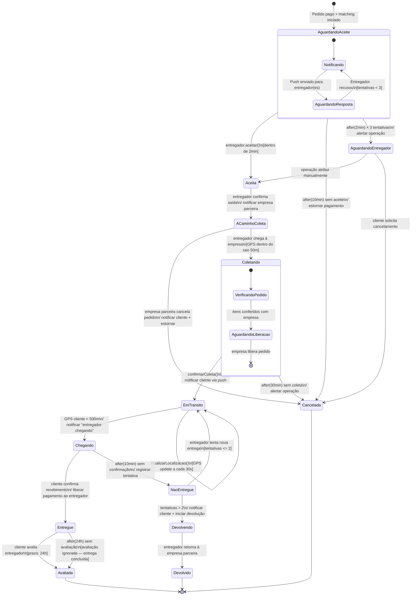

# 3. Modelagem Comportamental — Fatia 2

## Ciclo de vida da entrega com rastreamento em tempo real

---

## 3.1 Escolha do Tipo de Diagrama

**Diagrama selecionado**: **Diagrama de Estados**

**Justificativa**: A Fatia 2 modela o **ciclo de vida completo de uma entrega** — uma entidade com identidade clara (`Entrega`) que passa por estados bem definidos, com transições disparadas por eventos externos (aceite do entregador, atualização de GPS, confirmação do cliente) e internos (timeouts). O diagrama de estados é o mais adequado porque:

- A entidade `Entrega` tem **8 estados distintos** com semântica diferente em cada um
- As transições têm **guardas** (condições) e **ações** associadas (notificações, updates no banco)
- Há **eventos temporais** (`after(5min)`, `after(30min)`) que dispararm transições automáticas
- Existem **estados terminais alternativos** (entregue com sucesso vs. cancelada)

Diagrama de sequência seria inadequado aqui — mostraria apenas um fluxo linear e não capturaria as transições de estado e os timeouts com clareza.

---

## 3.2 Diagrama de Estados UML (Mermaid)



---

## 3.3 Análise dos Estados

### 3.3.1 Descrição de Cada Estado

| Estado                   | Responsável          | Descrição                                                    | Ação de Entry                                                    |
| ------------------------ | -------------------- | ------------------------------------------------------------ | ---------------------------------------------------------------- |
| **AguardandoAceite**     | Sistema              | Notificações enviadas; aguardando aceite de entregador       | Iniciar timer de 2min; enviar push para top 3                    |
| **AguardandoEntregador** | Operação             | Tentativas automáticas esgotadas; requer intervenção manual  | Alertar equipe ops; notificar cliente                            |
| **Aceita**               | Entregador           | Entregador confirmou que irá realizar a entrega              | Marcar entregador como indisponível; registrar `data_atribuicao` |
| **ACaminhoColeta**       | Entregador           | Entregador a caminho da empresa parceira para retirar pedido | Notificar empresa parceira para preparar                         |
| **Coletando**            | Entregador + Empresa | Entregador chegou ao local; verificando e coletando itens    | Iniciar timer de 30min                                           |
| **EmTransito**           | Entregador           | Pedido coletado; entregador a caminho do cliente             | Registrar `data_coleta`; notificar cliente                       |
| **Chegando**             | Sistema (GPS)        | Entregador a menos de 500m do destino                        | Enviar push "seu pedido está chegando"                           |
| **NaoEntregue**          | Sistema              | Cliente não estava disponível para receber                   | Registrar tentativa; iniciar timeout                             |
| **Entregue**             | Cliente              | Cliente confirmou recebimento                                | Registrar `data_entrega`; iniciar liberação do pagamento         |
| **Devolvendo**           | Entregador           | Após tentativas malsucedidas; retornando à origem            | Notificar cliente sobre devolução                                |
| **Devolvido**            | Sistema              | Pedido devolvido à empresa parceira                          | Iniciar processo de reembolso/novo pedido                        |
| **Avaliada**             | Cliente/Sistema      | Ciclo completo concluído                                     | Recalcular `avaliacao_media` do entregador                       |
| **CancelDA**             | Vários               | Estado terminal de cancelamento                              | Estornar pagamento; liberar entregador                           |

---

### 3.3.2 Transições com Guardas e Ações

**Formato UML**: `evento [guarda] / ação`

| Transição                     | Evento                 | Guarda                       | Ação                                            |
| ----------------------------- | ---------------------- | ---------------------------- | ----------------------------------------------- |
| `AguardandoAceite → Aceita`   | `entregador.aceitar()` | `[dentro de 2min]`           | Criar `Entrega`; marcar entregador indisponível |
| `AguardandoAceite → CancelDA` | `after(10min)`         | `[3 tentativas esgotadas]`   | Estornar pagamento; liberar estoque             |
| `Coletando → EmTransito`      | `confirmarColeta()`    | `[itens verificados]`        | Registrar `data_coleta`; push ao cliente        |
| `EmTransito → Chegando`       | Atualização GPS        | `[distância < 500m]`         | Push "entregador chegando"                      |
| `NaoEntregue → EmTransito`    | `tentarNovamente()`    | `[tentativas ≤ 2]`           | Registrar nova tentativa                        |
| `Entregue → Avaliada`         | `after(24h)`           | `[sem avaliação do cliente]` | Encerrar ciclo automaticamente                  |

---

### 3.3.3 Eventos Temporais (Timeouts)

Os timeouts são críticos para o SLA do sistema. Abaixo, os principais com suas consequências:

| Timeout                     | Estado Origem      | Duração              | Consequência                        |
| --------------------------- | ------------------ | -------------------- | ----------------------------------- |
| Aceite não recebido         | `AguardandoAceite` | 2 min por entregador | Tentar próximo entregador           |
| Nenhum aceite após 3 rounds | `AguardandoAceite` | ~10 min total        | Alertar ops; `AguardandoEntregador` |
| Coleta não confirmada       | `Coletando`        | 30 min               | Alertar ops; possível cancelamento  |
| Cliente ausente             | `Chegando`         | 10 min               | Registrar `NaoEntregue`; retry      |
| Avaliação não feita         | `Entregue`         | 24 h                 | Encerrar ciclo normalmente          |

---

### 3.3.4 Estados Compostos

O diagrama utiliza dois **estados compostos** (subestados):

**`AguardandoAceite`** é composto por:

- `Notificando`: push sendo enviado
- `AguardandoResposta`: aguardando aceite ou recusa

Isso representa que dentro de "aguardar aceite" pode haver múltiplas rodadas de notificação antes de esgotar as tentativas.

**`Coletando`** é composto por:

- `VerificandoPedido`: entregador confere itens
- `AguardandoLiberacao`: empresa prepara e libera

Modelado como composto porque o tempo neste estado não é ocioso — há atividade entre entregador e empresa.

---

### 3.3.5 Diferença entre Estado da Entrega e Estado do Pedido

Conforme identificado na seleção de escopo, os estados são **ortogonais**:

| Estado do Pedido | Estado da Entrega  | Interpretação                                         |
| ---------------- | ------------------ | ----------------------------------------------------- |
| `PAGO`           | `AguardandoAceite` | Pagamento confirmado, entregador ainda não encontrado |
| `PAGO`           | `Aceita`           | Entregador a caminho para coletar                     |
| `EM_ENTREGA`     | `EmTransito`       | Pedido saiu da empresa, em caminho ao cliente         |
| `ENTREGUE`       | `Avaliada`         | Ciclo completo                                        |
| `CANCELADO`      | `CancelDA`         | Ambos transitam juntos para cancelamento              |

O pedido **não** muda de estado enquanto a entrega está em `EmTransito` → `Chegando` → `Entregue`. A atualização do pedido para `ENTREGUE` ocorre apenas quando o cliente confirma recebimento.

---

## 3.4 Eventos Externos Assíncronos

A Fatia 2 expõe um desafio importante: **atualizações de GPS** disparam a transição `EmTransito → Chegando` automaticamente, sem ação do entregador.

Isso significa que o sistema precisa de um **consumer de eventos assíncronos**:

```
GPS do entregador → Kafka/SQS → Consumer →
  verificar distância → se < 500m → transicionar estado
```

No diagrama de estados, essa transição é modelada como `evento [guarda]`:

- Evento: `atualizarLocalizacao()`
- Guarda: `[GPS cliente < 500m]`

A implementação real usa geofencing — área circular em torno do destino, e quando o entregador entra nessa área, o evento é disparado automaticamente.

---

## 3.5 Rastreabilidade com Histórias de Usuário

| História                                              | Estados/Transições Cobertos                               |
| ----------------------------------------------------- | --------------------------------------------------------- |
| **US-LOG-003** (visualizar detalhes antes de aceitar) | `AguardandoAceite → Aceita`                               |
| **US-LOG-004** (confirmar coleta)                     | `Coletando → EmTransito`                                  |
| **US-LOG-006** (rastrear em tempo real)               | Estados `EmTransito`, `Chegando`; loop de atualização GPS |
| **US-LOG-009** (confirmar recebimento e avaliar)      | `Chegando → Entregue → Avaliada`                          |
| **US-LOG-010** (entregador avalia cliente)            | Estado `Avaliada` (avaliação bidirecional)                |

---

## 3.6 Limitações do Diagrama

O que não está representado por simplificação:

1. **Rastreamento offline**: entregador sem internet acumula pontos GPS e sincroniza — não altera estados, apenas enriquece `PONTO_RASTREAMENTO`.
2. **Disputas pós-entrega**: cliente alega não receber mesmo após confirmar — fluxo de disputa separado, fora do ciclo de vida principal.
3. **Regiões ortogonais de avaliação**: cliente e entregador se avaliam simultaneamente após entrega — modelar como regiões paralelas tornaria o diagrama complexo sem ganho prático.

---

**Próximo:** [`docs/03-comportamental-fatia3.md`](03-comportamental-fatia3.md)
