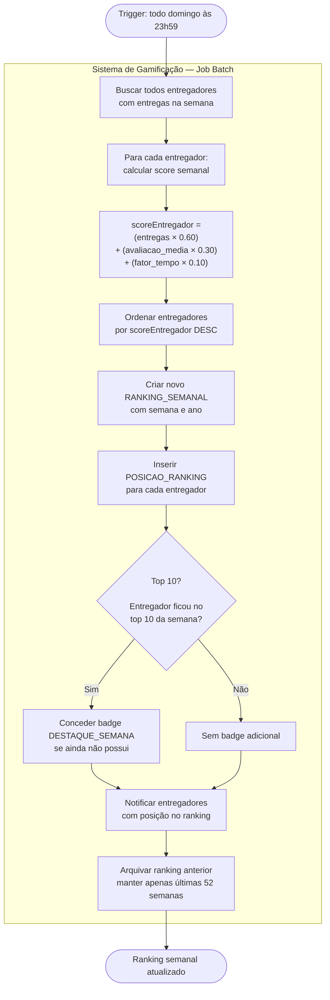

# 3. Modelagem Comportamental — Fatia 3

## Sistema de gamificação e bonificação para entregadores

---

## 3.1 Escolha do Tipo de Diagrama

**Diagrama selecionado**: **Diagrama de Atividades**

**Justificativa**: A Fatia 3 modela um **fluxo de cálculo com múltiplas decisões compostas e processamento paralelo**, envolvendo dois atores distintos (Entregador e Sistema de Gamificação). O diagrama de atividades é o mais adequado porque:

- O cálculo de bonificação envolve **decisões em cadeia** (horário de pico? região de alta demanda? streak ativo? nível do entregador?) — ideal para nós de decisão (losangos)
- O desbloqueio de badges e a atualização do ranking ocorrem **em paralelo** após a entrega — ideal para fork/join
- Há **múltiplos atores executando partes do fluxo** — ideal para swimlanes (raias)
- O fluxo tem **processamento em tempo real** (bonificação por entrega) e **batch periódico** (ranking semanal) — dois subfluxos que o diagrama de atividades consegue expressar separadamente

Diagrama de estados seria inadequado — não há entidade com ciclo de vida linear aqui. Diagrama de sequência perderia a visibilidade das decisões de negócio encadeadas.

---

## 3.2 Diagrama de Atividades UML (Mermaid)

### 3.2.1 Fluxo Principal — Cálculo de Bonificação por Entrega

```mermaid
flowchart TD
    Start([Entrega confirmada pelo cliente]) --> A

    subgraph Entregador
        A[Entrega marcada como ENTREGUE]
    end

    subgraph SistemaGamificacao ["Sistema de Gamificação"]
        A --> B[Recuperar PerfilGamificacao do entregador]
        B --> C{Nível do entregador?}

        C -->|BRONZE| D1[percentualBase = 5%]
        C -->|PRATA| D2[percentualBase = 7%]
        C -->|OURO| D3[percentualBase = 9%]
        C -->|PLATINA/DIAMANTE| D4[percentualBase = 12%]

        D1 & D2 & D3 & D4 --> E[bonificacaoBase = valorFrete × percentualBase]

        E --> F{Horário de pico?\n08h-12h ou 18h-22h}
        F -->|Sim| G1[multiplicadorHorario = 1.30]
        F -->|Não| G2[multiplicadorHorario = 1.00]

        G1 & G2 --> H{Região de alta demanda?\nConsultar TABELA_MULTIPLICADORES}
        H -->|Sim| I1[multiplicadorRegiao = 1.20]
        H -->|Não| I2[multiplicadorRegiao = 1.00]

        I1 & I2 --> J{Streak ativo?\nstreakDias >= 3}
        J -->|Sim, 3-6 dias| K1[multiplicadorStreak = 1.10]
        J -->|Sim, 7+ dias| K2[multiplicadorStreak = 1.20]
        J -->|Não| K3[multiplicadorStreak = 1.00]

        K1 & K2 & K3 --> L[bonificacaoFinal = bonificacaoBase\n× horario × regiao × streak]
        L --> M[Registrar bonificação no histórico]
        M --> N[Adicionar pontos ao PerfilGamificacao\npontos += calcularPontos bonificacaoFinal]

        N --> Fork1{fork}

        Fork1 --> P1[Verificar elegibilidade\nde badges]
        Fork1 --> P2[Atualizar streak do entregador]
        Fork1 --> P3[Atualizar avaliacao_media\ne total_entregas]

        P1 --> Q{Algum critério\nde badge atingido?}
        Q -->|Sim| R[Desbloquear badge\nregistrar data_desbloqueio]
        Q -->|Não| S1[Sem novo badge]
        R --> S1

        P2 --> T{Entrega foi hoje?\n[mesma data da última]}
        T -->|Sim| U1[streakDias++]
        T -->|Não — gap de 1 dia| U2[streakDias = 0\nreiniciar streak]
        T -->|Entregador novo| U3[streakDias = 1]
        U1 & U2 & U3 --> V1[Atualizar data_ultima_entrega]

        P3 --> V2[Recalcular avaliacao_media\ne total_entregas via query]

        S1 --> Join1{join}
        V1 --> Join1
        V2 --> Join1

        Join1 --> W{Entregador subiu\nde nível?\nVerificar thresholds de pontos}
        W -->|Sim| X[Atualizar nivel\nNotificar entregador: parabéns!]
        W -->|Não| Y[Manter nível atual]
        X & Y --> Z[Emitir evento EntregaConcluida\npara ranking batch]
    end

    Z --> End([Fluxo por entrega concluído])
```

### 3.2.2 Subfluxo — Atualização de Ranking Semanal (Processamento Batch)



---

## 3.3 Análise dos Elementos do Diagrama

### 3.3.1 Swimlanes (Raias)

O diagrama principal usa duas raias:

| Raia                       | Responsabilidades                                            |
| -------------------------- | ------------------------------------------------------------ |
| **Entregador**             | Disparador passivo — a confirmação de entrega inicia o fluxo |
| **Sistema de Gamificação** | Toda a lógica de cálculo, decisões e atualizações de perfil  |

O entregador não executa nada no fluxo de cálculo — apenas recebe o resultado (notificação de badge, nível novo). Isso evidencia que a gamificação é **transparente para o entregador**: acontece automaticamente após cada entrega.

### 3.3.2 Nós de Decisão (Losangos)

Seis decisões encadeadas no fluxo principal:

1. **Nível do entregador** → determina `percentualBase` (Strategy por nível)
2. **Horário de pico** → aplica ou não `multiplicadorHorario` (regra temporal)
3. **Região de alta demanda** → consulta `TABELA_MULTIPLICADORES` configurável
4. **Streak ativo** → dois limiares diferentes (3-6 dias vs. 7+ dias)
5. **Badge elegível** → verifica critérios de cada badge não desbloqueado
6. **Subiu de nível** → compara pontos com thresholds de progressão

### 3.3.3 Fork/Join (Paralelismo)

Após calcular e registrar a bonificação, três ações ocorrem **em paralelo**:

- Verificar elegibilidade de badges
- Atualizar streak
- Recalcular métricas do entregador

O `join` garante que o fluxo só avança (verificar subida de nível) quando **os três ramos paralelos estiverem concluídos**.

**Por que paralelismo aqui?** Essas três operações são **independentes** entre si — não há dependência de dados entre verificar badge e atualizar streak. Executar em paralelo reduz latência total do pós-processamento da entrega.

### 3.3.4 As Regras de Negócio Não-Triviais Modeladas

**Cálculo de bonificação composta:**

```
bonificacaoFinal = valorFrete
                 × percentualBase(nivel)
                 × multiplicadorHorario
                 × multiplicadorRegiao
                 × multiplicadorStreak
```

Exemplo concreto (entregador OURO, horário de pico, região normal, streak 7 dias):

- Frete: R$ 12,00
- Base 9%: R$ 1,08
- × 1.30 (pico): R$ 1,40
- × 1.00 (região): R$ 1,40
- × 1.20 (streak 7d): **R$ 1,69 de bonificação**

**Score do ranking semanal:**

```
score = (totalEntregas × 0.60)
      + (avaliacaoMedia × 0.30)
      + (fatorTempo × 0.10)
```

O `fatorTempo` é calculado como `(tempoMedioMeta / tempoMedioReal)`, capped em 1.0.

---

## 3.4 Relação com o Diagrama de Classes (Seção 1)

O fluxo de atividades materializa os seguintes métodos do diagrama de classes:

| Atividade no Diagrama            | Método no Diagrama de Classes                       |
| -------------------------------- | --------------------------------------------------- |
| Calcular bonificação final       | `BonificacaoComposta.calcular()`                    |
| Aplicar multiplicador de horário | `BonificacaoComposta.aplicarMultiplicadorHorario()` |
| Aplicar multiplicador de região  | `BonificacaoComposta.aplicarMultiplicadorRegiao()`  |
| Aplicar multiplicador de streak  | `BonificacaoComposta.aplicarMultiplicadorStreak()`  |
| Verificar desbloqueio de badge   | `Badge.verificarDesbloqueio()`                      |
| Adicionar pontos ao perfil       | `PerfilGamificacao.adicionarPontos()`               |
| Atualizar streak                 | `PerfilGamificacao.atualizarStreak()`               |
| Calcular ranking semanal         | `RankingSemanal.atualizarRanking()`                 |

---

## 3.5 Relação com o MER (Seção 2)

As atividades mapeiam para operações no banco:

| Atividade                 | Tabela(s) afetada(s)                 | Operação                                    |
| ------------------------- | ------------------------------------ | ------------------------------------------- |
| Registrar bonificação     | `PERFIL_GAMIFICACAO`                 | UPDATE `pontos_acumulados`                  |
| Desbloquear badge         | `ENTREGADOR_BADGE`                   | INSERT com `data_desbloqueio`               |
| Atualizar streak          | `PERFIL_GAMIFICACAO`                 | UPDATE `streak_dias`, `data_ultima_entrega` |
| Subir de nível            | `PERFIL_GAMIFICACAO`                 | UPDATE `nivel`                              |
| Atualizar ranking         | `RANKING_SEMANAL`, `POSICAO_RANKING` | INSERT novo ranking                         |
| Consultar multiplicadores | `TABELA_MULTIPLICADORES`             | SELECT por tipo e condição                  |

---

## 3.6 Rastreabilidade com Histórias de Usuário

| História                                        | Atividade no Diagrama                                                      |
| ----------------------------------------------- | -------------------------------------------------------------------------- |
| **US-GAM-001** (ver ranking semanal)            | Subfluxo batch — criação de `RANKING_SEMANAL` e `POSICAO_RANKING`          |
| **US-GAM-003** (desbloquear badges)             | Ramo paralelo de verificação de badges; nó de decisão "critério atingido?" |
| **US-GAM-005** (calcular bonificação variável)  | Fluxo completo de decisões de multiplicadores                              |
| **US-BON-002** (bonificação em horário de pico) | Nó de decisão "horário de pico?" com `multiplicadorHorario = 1.30`         |

---

## 3.7 Considerações sobre `TABELA_MULTIPLICADORES`

A decisão "Região de alta demanda?" consulta a `TABELA_MULTIPLICADORES` no banco em vez de ter os valores hard-coded. Isso permite:

- **Configuração em tempo real**: ops pode ativar um multiplicador de região sem deploy
- **A/B testing**: diferentes multiplicadores por cidade
- **Sazonalidade**: multiplicadores maiores em datas especiais (Natal, Dia dos Namorados)

Estrutura da tabela (do MER):

```sql
tipo: 'REGIAO_DEMANDA'
condicao: '{"bairros": ["Pinheiros", "Vila Madalena"], "cep_range": ["05xxx", "01xxx"]}'
multiplicador: 1.20
ativo: true
```

---

**Próximo:** [`docs/04-casos-de-teste.md`](04-casos-de-teste.md)
